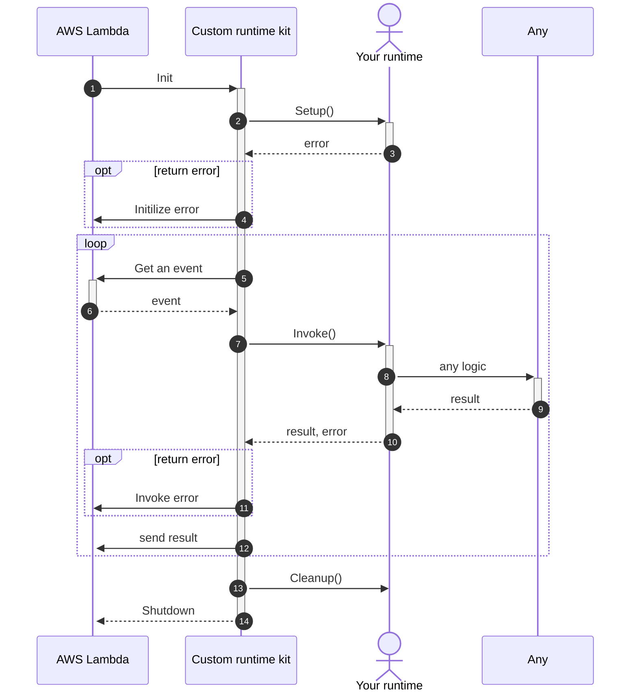

# AWS Lambda Custom Runtime kit

A kit to easily create AWS Lambda custom runtime in go!

[](https://github.com/WinterYukky/aws-lambda-custom-runtime-kit/actions)
[](https://opensource.org/licenses/MIT)

## ⚠️ Do you really need this?

If you need a simple custom runtime, please see the [documentation for Lambda container images](https://docs.aws.amazon.com/lambda/latest/dg/images-create.html). 

Don't?
Then let's create a crazy runtime with me!

## Install

```shell
go get github.com/WinterYukky/aws-lambda-custom-runtime-kit
```

## Get Started

Create struct that implemented `AWSLambdaRuntime`, and call `NewAWSLambdaCustomRuntime(runtime).Invoke()`.

```go
type AWSLambdaRuntime interface {
	Setup(env *AWSLambdaRuntimeEnvironemnt) error
	Invoke(event []byte, context *Context) (interface{}, error)
	Cleanup(env *AWSLambdaRuntimeEnvironemnt)
}
```

> When result type of `Invoke()` is string, then string is output as is. Else marshal to json string.


## Architecture

AWS Lambda Custom Runtime kit abstracts the AWS Lambda runtime API and simplifies the creation of custom runtimes by writing only the necessary parts.

Next, the architecture of the AWS Lambda Custom Runtime kit is represented in the sequence diagram.



## Example of shell runtime


`main.go`
```go
package main

import (
	"fmt"
	"log"
	"os/exec"

	crkit "github.com/WinterYukky/aws-lambda-custom-runtime-kit"
)

func main() {
	bashRuntime := BashRuntime{}
	customRuntime := crkit.NewAWSLambdaCustomRuntime(bashRuntime)
	if err := customRuntime.Invoke(); err != nil {
		log.Fatalf("Failed to invoke lambda: %v", err)
	}
}

type BashRuntime struct {}

func (b BashRuntime) Setup(env *crkit.AWSLambdaRuntimeEnvironemnt) error {
	return nil
}

func (b BashRuntime) Invoke(event []byte, context *crkit.Context) (interface{}, error) {
	source := fmt.Sprintf("%v/%v.sh", context.LambdaTaskRoot, context.Handler)
	output, err := exec.Command("sh", source).Output()
	if err != nil {
		return nil, err
	}
    // do not return []byte, cast to string
	return string(output), nil
}

func (b BashRuntime) Cleanup(env *crkit.AWSLambdaRuntimeEnvironemnt) {}
```

### Build

```shell
$ go build -a -tags netgo -installsuffix netgo --ldflags '-extldflags "-static"' -o bootstrap
$ zip runtime.zip bootstrap
```

### Upload as Lambda layer

You can upload runtime.zip as Lambda layer.

### Write your shell script

You can write script and invoke🎉

```sh
echo '{"body": "Hello World", "statusCode": 200}'
```

The script returns this output.

```json
{
    "body": "Hello World",
    "statusCode": 200
}
```

## Example of SQL runtime

Please see the [AWS Lambda SQL Runtime repository](https://github.com/WinterYukky/aws-lambda-sql-runtime)

This runtime can writen lambda handler by SQL (sqlite3).

```sql
SELECT 'Hello World' body, 200 statusCode;
```

The SQL return this output.
```json
{
    "body": "Hello World",
    "statusCode": 200
}
```